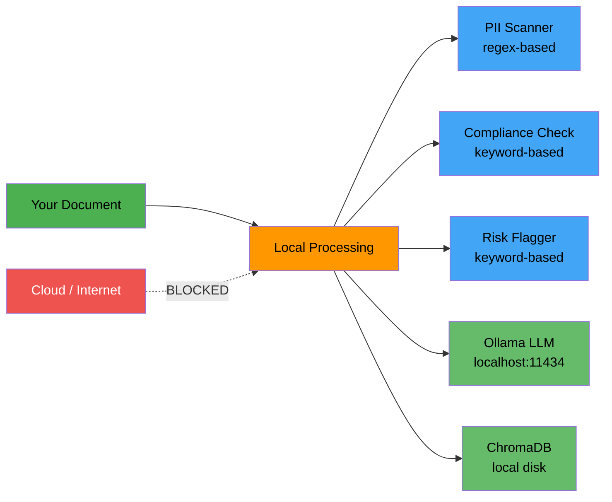

# Private Docs Auditor

**On-premise document intelligence system** — fully local LLM, local embeddings, local vector store. Zero cloud dependency. Built for sensitive data in **FinTech**, **Legal**, and **Healthcare**.

No API keys. No data exfiltration. Everything runs on your machine.

---

## Features

### Document Audit (offline, no LLM needed)
- **PII Detection** — SSN, credit cards, emails, phones, IBAN, passport numbers
- **Compliance Check** — GDPR, HIPAA, SOX, PCI-DSS keyword analysis
- **Risk Flagging** — financial, legal, and operational risk indicators
- **Downloadable report** — Markdown audit report with severity ratings

### RAG Q&A (requires Ollama)
- **Local LLM** — Llama 3.2, Mistral, or any Ollama model
- **Local embeddings** — nomic-embed-text (no OpenAI)
- **Local vector store** — ChromaDB on disk
- **Sourced answers** — every response includes page and document references

---

## Privacy Architecture



**Zero cloud guarantee:**
- LLM → Ollama (runs locally)
- Embeddings → nomic-embed-text via Ollama (runs locally)
- Vector store → ChromaDB (persisted to disk)
- No API keys required
- No network calls

---

## Setup

**1. Install Ollama**

```bash
# macOS
brew install ollama

# Linux
curl -fsSL https://ollama.com/install.sh | sh
```

**2. Pull the models**

```bash
ollama pull llama3.2
ollama pull nomic-embed-text
```

**3. Clone and install**

```bash
git clone https://github.com/AIassistent2025/private-docs-auditor.git
cd private-docs-auditor
python -m venv venv
source venv/bin/activate
pip install -r requirements.txt
```

---

## Usage

### CLI — Document Audit (no Ollama needed)

```bash
# Full audit: PII + compliance + risks
python main.py audit path/to/document.pdf

# Specific compliance framework
python main.py audit report.pdf --framework HIPAA

# JSON output
python main.py audit report.pdf --json
```

### CLI — RAG Q&A (requires Ollama)

```bash
# Start Ollama
ollama serve

# Index a document
python main.py ingest path/to/document.pdf

# Ask questions
python main.py query "What are the key financial risks?"

# Use a different model
python main.py query "Summarize the compliance gaps" --model mistral
```

### Streamlit Dashboard

```bash
streamlit run app.py
```

Open [http://localhost:8501](http://localhost:8501). The dashboard provides:
- **Audit tab** — PII scan, compliance check, risk flags with downloadable report
- **Q&A tab** — ask questions about uploaded documents via local LLM
- **Raw Text tab** — view extracted document content

---

## What Gets Detected

### PII Types
| Type | Pattern | Severity |
|---|---|---|
| Social Security Number | `XXX-XX-XXXX` | CRITICAL |
| Credit Card Number | `XXXX-XXXX-XXXX-XXXX` | CRITICAL |
| Email Address | `user@domain.com` | HIGH |
| IBAN | `DEXX XXXX XXXX XXXX` | HIGH |
| Phone Number (US) | `(XXX) XXX-XXXX` | MEDIUM |
| Passport Number | `AB1234567` | MEDIUM |

### Compliance Frameworks
| Framework | Focus |
|---|---|
| **GDPR** | EU data protection — consent, data subjects, processing |
| **HIPAA** | US healthcare — PHI, patient data, covered entities |
| **SOX** | US financial — internal controls, audit, Section 404 |
| **PCI-DSS** | Payment cards — cardholder data, encryption, tokenization |

### Risk Categories
| Category | Severity | Examples |
|---|---|---|
| Financial | HIGH | default, overdue, write-off, insolvency |
| Legal | HIGH | breach, violation, lawsuit, class action |
| Operational | MEDIUM | outage, data loss, vulnerability, unauthorized access |

---

## Project Structure

```
private-docs-auditor/
├── src/
│   ├── __init__.py
│   ├── config.py        # Model names, paths, parameters
│   ├── ingestor.py      # PDF/text → chunks → ChromaDB (local embeddings)
│   ├── qa_chain.py      # Local RAG chain (Ollama LLM + ChromaDB retrieval)
│   └── auditor.py       # PII detection, compliance scanning, risk flags
├── tests/
│   ├── __init__.py
│   └── test_core.py     # 26 tests — all run offline, no Ollama needed
├── data/                # Place your documents here
├── app.py               # Streamlit dashboard
├── main.py              # CLI (audit, ingest, query, clear)
├── requirements.txt
└── .gitignore
```

---

## Running Tests

```bash
pytest tests/ -v
```

All 26 tests run **offline** — no Ollama, no API keys, no network.

---

## Tech Stack

| Component | Technology | Cloud? |
|---|---|---|
| LLM | Ollama (Llama 3.2 / Mistral) | Local |
| Embeddings | nomic-embed-text via Ollama | Local |
| Vector Store | ChromaDB | Local (disk) |
| PII Scanner | Regex patterns | Local |
| Compliance | Keyword matching | Local |
| Web UI | Streamlit | Local |
| CLI | argparse | Local |

---

## License

MIT
